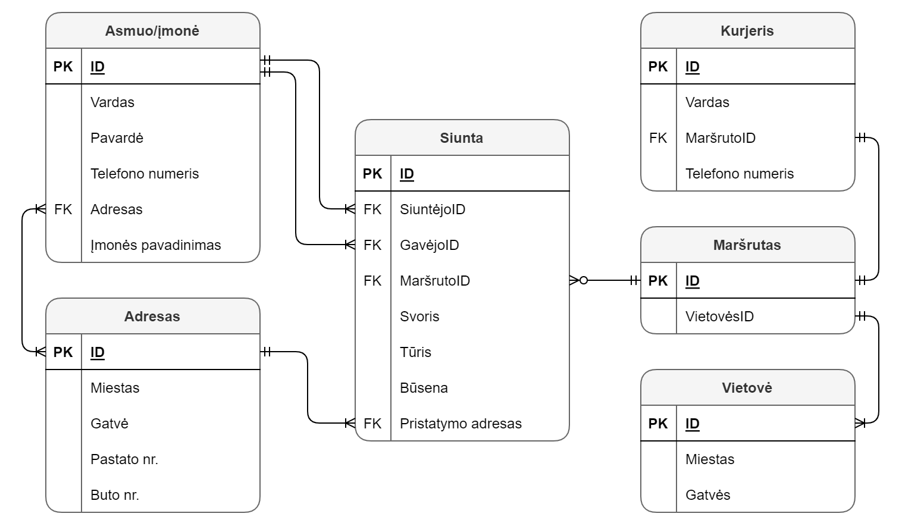

# MongoDB

Kurjerių paslaugos.

### Duomenų bazės struktūros diagrama


Sukuriamos 3 kolekcijos: *routes*, *couriers*, *shipments*.
* **routes** kolekcija apjungia maršrutų ir vietovių lenteles;
* **couriers** kolekcija saugo kurjerių duomenis;
* **shipments** kolekcija saugo siuntų, siuntėjų, gavėjų ir adresų duomenis.

### Užklausos

1. Iš *shipments* kolekcijos nuskaitomi visų siuntų siuntėjų adresai
```
{'miestas': 'Vilnius', 'gatvė': 'Didlaukio', 'namoNr': '47', 'butoNr': None}
{'miestas': 'Vilnius', 'gatvė': 'Ateities', 'namoNr': '15', 'butoNr': None}
{'miestas': 'Vilnius', 'gatvė': 'Geležinio Vilko', 'namoNr': '30', 'butoNr': None}
{'miestas': 'Vilnius', 'gatvė': 'Ukmergės', 'namoNr': '47', 'butoNr': None}
{'miestas': 'Kaunas', 'gatvė': 'Vilniaus', 'namoNr': '47', 'butoNr': None}
```
2. Randamas kiekvieno maršruto bendras siuntų svoris
```
{'_id': ObjectId('6370a77747c8161ffcbe403f'), 'bendras_svoris': 10.5}
{'_id': ObjectId('6370a77747c8161ffcbe4040'), 'bendras_svoris': 9.8}
```
3. 2 užklausa atliekama su Map Reduce
```
{'_id': ObjectId('6370a77747c8161ffcbe403f'), 'value': 10.5}
{'_id': ObjectId('6370a77747c8161ffcbe4040'), 'value': 9.8}
```