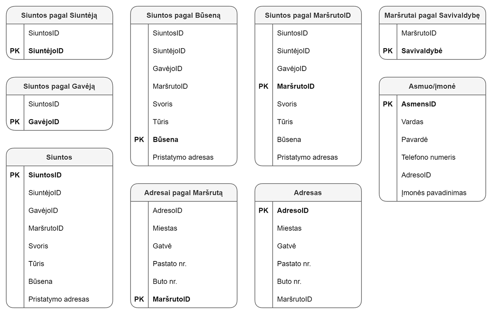

# Cassandra

### Užduoties formuluotė
>Sumodeliuokite nesudėtingą sritį Cassandra duomenų bazėje. Parašykite programą naudojančią duomenų bazę ir leidžiančią atlikti kelias operacijas pasirinktoje srityje.

>Su programa pateikite duomenų modelio diagramą.

>Savybės sričiai:

>1) Egzistuoja bent kelios esybės
>2) Yra bent dvi esybės su vienas-su-daug sąryšiu
>3) Panaudojimo atvejuose bent vienai esybei reikalingos kelios užklausos pagal skirtingus parametrus

>Pavyzdžiui,  banke saugome klientus, jų sąskaitas (vienas su daug sąryšis) ir kreditines korteles. Sąskaitų norime ieškoti pagal klientą (rasti visas jo sąskaitas) bei pagal sąskaitos numerį, klientų norime ieškoti pagal jų kliento ID arba asmens kodą. Kredito kortelių norime ieškoti pagal jų numerį,  taip pat norime rasti sąskaitą susietą su konkrečia kortele.

>Bent vienoje situacijoje prasmingai panaudokite Cassandra compare-and-set operacijas (hint: IF) INSERT ar UPDATE sakinyje. Pavyzdžiui, norime sukurti naują sąskaitą su kodu tik jei ji neegzistuoja. Norime pervesti pinigus, tik jei likutis pakankamas.

# Duomenų bazės modelis
Pasirinkta dalykinė sritis - kurjerių paslaugos. Duomenų bazę sudaro 4 esybės: Siuntos, Asmenys, Adresasi ir Maršrutai. Sukuriamos 9 lentelės pagal potencialias užklausas.



## Užklausos

1. Q1 - Rodyti maršrutus pagal savivaldybę.
```
SELECT * FROM routes_by_municipality WHERE municipality = 'Švenčionių r.';
```
```
Row(municipality='Švenčionių r.', routeid=33)
```
2. Q2 - Rodyti siuntas pagal maršruto numerį.
```
SELECT * FROM shipments_by_route WHERE routeID = 33;
```
```
Row(routeid=33, shipmentid=2, addressid=3, receiverid=3, senderid=1, state='Perduota kurjeriui', volume=0.009999999776482582, weight=10.0)
Row(routeid=33, shipmentid=3, addressid=5, receiverid=5, senderid=4, state='Perduota kurjeriui', volume=0.0005000000237487257, weight=0.75)
```
3. Q3 - Rodyti siuntos informaciją.
```
SELECT * FROM shipments
```
```
Row(shipmentid=1, addressid=1, receiverid=2, routeid=29, senderid=1, state='Terminale', volume=0.0010000000474974513, weight=4.5)
Row(shipmentid=2, addressid=3, receiverid=3, routeid=33, senderid=1, state='Perduota kurjeriui', volume=0.009999999776482582, weight=10.0)
Row(shipmentid=3, addressid=5, receiverid=5, routeid=33, senderid=4, state='Perduota kurjeriui', volume=0.0005000000237487257, weight=0.75)
```
4. Q4 - Rodyti siuntėjo/gavėjo informaciją.
```
SELECT * FROM person
```
```
Row(personid=5, adresoid=5, companyname=None, lastname='Mykolaitis-Putinas', name='Vincas', phonenumber='863343433')
Row(personid=1, adresoid=1, companyname='Pigu.lt', lastname=None, name=None, phonenumber='861122333')
Row(personid=2, adresoid=2, companyname=None, lastname='Smetona', name='Antanas', phonenumber='861245780')
Row(personid=4, adresoid=4, companyname='Senukai', lastname=None, name=None, phonenumber='867877891')
Row(personid=3, adresoid=3, companyname=None, lastname='Donelaitis', name='Kristijonas', phonenumber='867888997')
```
5. Q5 - Rodyti asmens išsiųstas siuntas.
```
SELECT * FROM shipments_by_sender WHERE senderID = 1;
```
```
Row(senderid=1, shipmentid=1)
Row(senderid=1, shipmentid=2)
```
6. Q6 - Rodyti asmens gautas siuntas.
```
SELECT * FROM shipments_by_receiver WHERE receiverID = 2;
```
```
Row(receiverid=2, shipmentid=1)
```
7. Q7 - Rodyti siuntas pagal būseną.
```
SELECT * FROM shipments_by_state WHERE state = 'Perduota kurjeriui';
```
```
Row(state='Perduota kurjeriui', shipmentid=2, addressid=3, receiverid=3, routeid=33, senderid=1, volume=0.009999999776482582, weight=10.0)
Row(state='Perduota kurjeriui', shipmentid=3, addressid=5, receiverid=5, routeid=33, senderid=4, volume=0.0005000000237487257, weight=0.75)
```
8. Q8 - Rodyti pristatymo adresą.
```
SELECT * FROM address WHERE addressID = 5;
```
```
Row(addressid=5, building='1', city='Švenčionys', flat=None, routeid=33, street='Vilniaus')
```
9. Q9 - Rodyti adresus pagal maršrutoID.
```
SELECT * FROM address_by_route WHERE routeID = 29;
```
```
Row(routeid=29, addressid=1, building='1', city='Vilnius', flat=None, street='Ukmergės')
Row(routeid=29, addressid=4, building='2', city='Vilnius', flat=None, street='Ukmergės')
```